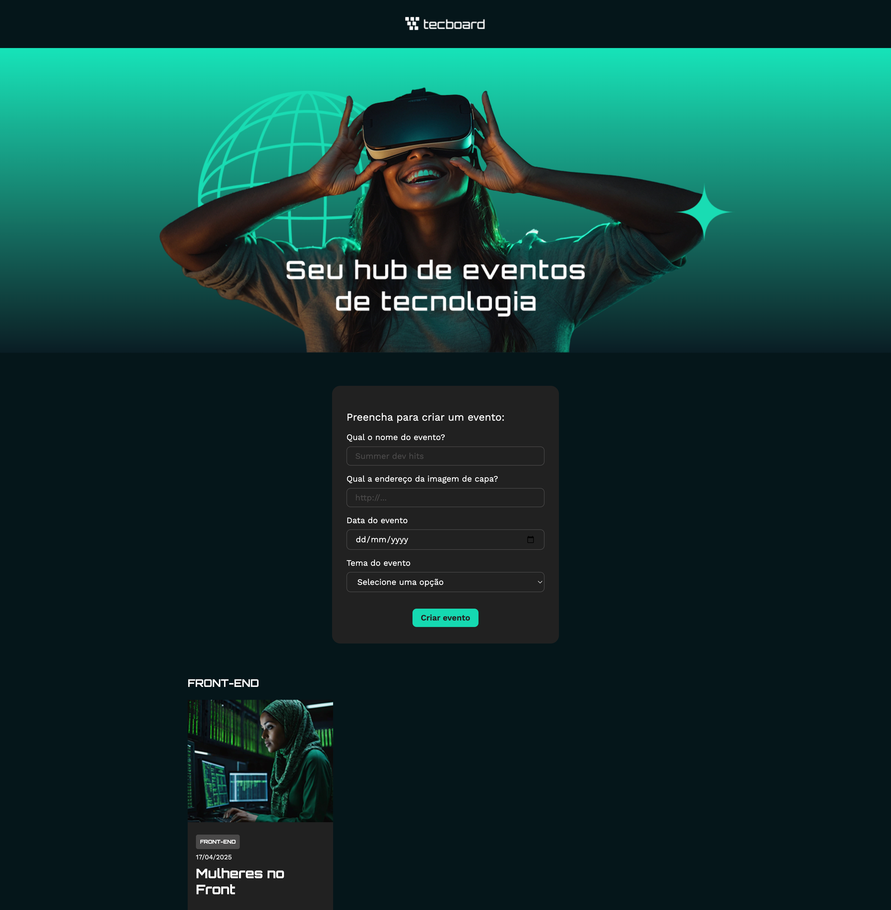

# 💻 Tecboard

O **Tecboard** é um hub de eventos de tecnologia desenvolvido com React. O projeto permite criar, organizar e visualizar eventos relacionados a diferentes áreas da tecnologia, como Front-end, Back-end, DevOps, Inteligência Artificial, Data Science e Cloud.

## 🔨 Funcionalidades

* Criação de eventos personalizados
* Cadastro de título, data, imagem e tema
* Organização dos eventos por tema
* Listagem dinâmica dos eventos
* Gerenciamento dos eventos utilizando o estado do React
* Formulário para cadastro de novos eventos
* Interface responsiva e componentizada



## 🚀 Tecnologias utilizadas

* **React**
* **Vite**
* **JavaScript**
* **JSX**
* **useState**
* **FormData**
* **Componentização**
* **Props**
* **CSS**
* **Google Fonts**

## 📂 Estrutura do projeto

O projeto foi organizado em componentes para facilitar a manutenção e separar as responsabilidades da aplicação.

```text
src/
├── componentes/
│   ├── Banner/
│   ├── CardEvento/
│   ├── FormularioDeEvento/
│   └── Tema/
├── App.jsx
├── App.css
└── index.css
```

## 🛠️ Como executar o projeto

### 1. Clone o repositório

```bash
git clone https://github.com/MilenaAmaral/tecboard-react.git
```

### 2. Acesse a pasta

```bash
cd tecboard-react
```

### 3. Instale as dependências

```bash
npm install
```

### 4. Inicie o projeto

```bash
npm run dev
```

### 5. Acesse no navegador

```text
http://localhost:5173
```

## 🖼️ Imagens dos eventos

O projeto utiliza imagens disponibilizadas pelo repositório de assets do projeto.

Exemplos:

```text
https://raw.githubusercontent.com/viniciosneves/tecboard-assets/refs/heads/main/imagem_1.png

https://raw.githubusercontent.com/viniciosneves/tecboard-assets/refs/heads/main/imagem_extra_9.png
```

## 📚 Sobre o projeto

O **Tecboard** foi desenvolvido como parte dos meus estudos em **React na Alura**, com o objetivo de colocar em prática conceitos fundamentais do desenvolvimento de interfaces com React.

Durante o desenvolvimento, trabalhei conceitos como:

* Componentização
* JSX
* Props
* Manipulação de formulários
* FormData
* Gerenciamento de estado com `useState`
* Renderização de listas
* Eventos e ações de formulário
* Imutabilidade
* Estilização com CSS

Além de acompanhar os conteúdos estudados, utilizei o projeto como oportunidade para praticar a organização de componentes e compreender melhor o fluxo de dados e a interação entre formulário, estado e interface.

Este projeto faz parte da minha jornada de estudos e evolução como desenvolvedora.
